## Tuần 1 – Ngôn ngữ, Cơ sở dữ liệu, Linux

1\. Vấn đề hiệu năng thường gặp khi truy vấn:

Truy vấn chậm khi:

\- Dữ liệu lớn (hàng triệu dòng)

\- Dùng SELECT \* quá nhiều

\- Không có index

\- JOIN không có điều kiện rõ ràng

2\. Kỹ thuật tối ưu:

2.1 Sử dụng chỉ mục (index):

Chỉ mục giúp cơ sở dữ liệu tìm kiếm dữ liệu nhanh hơn bằng cách tạo một cấu trúc dữ liệu đặc biệt để tra cứu các giá trị.

2.2 Viết lại truy vấn:

Một số truy vấn có thể được viết lại theo cách hiệu quả hơn, ví dụ như sử dụng các phép nối (JOIN) thay thế cho các truy vấn con (subquery) hoặc sử dụng các hàm tổng hợp (aggregate functions) thay vì lặp lại các phép tính.

2.3 Tối ưu hóa phép nối (JOIN):

Phép nối là một thao tác tốn kém, vì vậy việc tối ưu hóa chúng là rất quan trọng. Điều này có thể bao gồm việc chọn các loại phép nối phù hợp, sử dụng chỉ mục trên các cột được nối, và giảm thiểu số lượng bảng được nối.

2.4 Giới hạn dữ liệu trả về:

Chỉ chọn các cột cần thiết từ cơ sở dữ liệu thay vì sử dụng SELECT \*. Điều này giúp giảm lượng dữ liệu được truyền tải và xử lý.

2.5 Sử dụng truy vấn con (subquery) một cách cẩn thận:

Truy vấn con có thể làm chậm truy vấn nếu không được sử dụng đúng cách. Hãy xem xét việc viết lại chúng thành các phép nối hoặc sử dụng các kỹ thuật khác để tối ưu hóa.

2.6 Sử dụng các stored procedure và view:

Stored procedure và view có thể giúp tăng hiệu suất bằng cách lưu trữ các truy vấn đã được biên dịch và tối ưu hóa trước.

2.7 Phân tích kế hoạch thực thi:

Các công cụ phân tích kế hoạch thực thi có thể giúp xác định các phần của truy vấn thực thi chậm và cần được tối ưu hóa.

2.8 Tránh các hàm trên cột trong mệnh đề WHERE:

Sử dụng hàm trên cột trong mệnh đề WHERE có thể ngăn chặn việc sử dụng chỉ mục, làm chậm truy vấn.

2.8 Sử dụng UNION ALL thay vì UNION khi có thể:

UNION ALL không cần loại bỏ các bản ghi trùng lặp, do đó nó nhanh hơn UNION.

2.9 Sử dụng EXISTS thay vì COUNT khi cần:

EXISTS chỉ cần tìm một bản ghi thỏa mãn điều kiện, trong khi COUNT phải đếm tất cả các bản ghi.

3\. Cú pháp linux cơ bản(Thao tác trên docker):\
3.1 Quản lý File & Thư mục:

| **Lệnh** | **Mô tả** |
| --- | --- |
| ls -lh | Liệt kê thư mục với định dạng dễ đọc (human readable) |
| du -sh \* | Xem dung lượng các file/thư mục |
| find . -name "\*.csv" | Tìm tất cả các file .csv |
| cp, mv, rm | Copy, di chuyển, xóa file |
| mkdir -p | Tạo thư mục kể cả khi thư mục cha chưa tồn tại |

Ví dụ: Lệnh ls

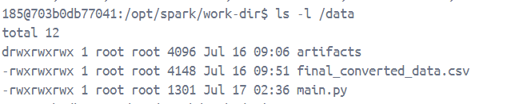

3.2 Xử lý file (CSV, JSON, Log, Parquet, …)

| **Lệnh** | **Mô tả** |
| --- | --- |
| head -n 10 data.csv | Xem 10 dòng đầu tiên của file data.csv |
| tail -f log.txt | Theo dõi file log theo thời gian thực |
| cut -d',' -f1,3 | Cắt và hiển thị cột 1 và 3 của file CSV |
| awk -F',' '{print $1, $2}' data.csv | Trích xuất cột từ CSV |
| sed 's/foo/bar/g' file.txt | Thay thế chuỗi trong file |
| sort, uniq, wc -l | Sắp xếp, loại trùng, đếm dòng |
| split -l 100000 data.csv | Tách file lớn thành file nhỏ (mỗi file 100k dòng) |
| jq, yq | Xử lý JSON/YAML (structured logs) |

Ví dụ với lệnh head: head -n 10 /data/final_converted_data.csv

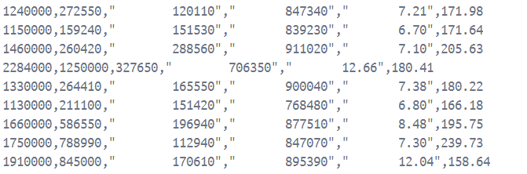

3.3 Quản lý process, tài nguyên hệ thống

| **Lệnh** | **Mô tả** |
| --- | --- |
| top, htop | Theo dõi tiến trình hệ thống |
| \`ps aux | grep python\` |
| kill -9 PID | Dừng process theo PID |
| free -h | Xem RAM đang sử dụng |
| df -h | Xem dung lượng ổ đĩa |
| ulimit -n | Xem/tăng số lượng file descriptor được mở (xử lý nhiều file song song) |

3.4 Làm việc với dữ liệu từ command-line

| **Lệnh** | **Mô tả** |
| --- | --- |
| curl, wget | Gọi API hoặc tải file từ web |
| ftp, sftp, scp, rsync | Truyền file từ xa (data ingestion) |
| ssh user@host | Kết nối đến server |
| grep, zgrep, egrep | Tìm chuỗi trong file (hữu ích với log, data text) |
| zcat, gunzip, bzcat, xzcat | Xem file nén .gz, .bz2, .xz không cần giải nén |

3.5 Kết nối và tương tác với Database

| **Lệnh** | **Mô tả** |
| --- | --- |
| psql -U user -d dbname | Kết nối PostgreSQL |
| mysql -u user -p | Kết nối MySQL |
| clickhouse-client | Dùng với ClickHouse |
| sqlite3 mydata.db | SQLite CLI |
| csvsql, csvkit | Dùng để thao tác CSV như SQL (cài bằng pip) |

Ví dụ: Kết nối với mysql

mysql -h host.docker.internal -u root -p

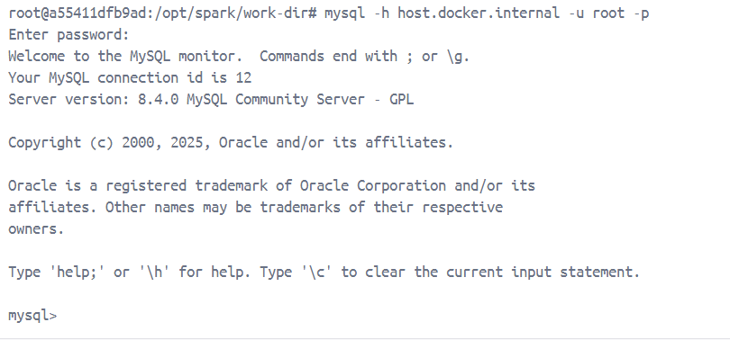

3.6 Xử lý song song

| **Lệnh** | **Mô tả** |
| --- | --- |
| xargs -P | Chạy song song các command |
| parallel | GNU Parallel – cực mạnh cho xử lý hàng loạt file |
| while read line; do ...; done < file.txt | Duyệt từng dòng xử lý |

## Tuần 2 – Kiến trúc Dữ liệu: OLTP, OLAP, CAP, ETL

1. Kiến trúc OLTP vs OLAP

| **Đặc điểm** | **OLTP (Xử lý giao dịch trực tuyến)** | **OLAP (Xử lý phân tích trực tuyến)** |
| --- | --- | --- |
| **Mục tiêu chính** | Xử lý số lượng lớn các giao dịch nhỏ và thường xuyên (giao dịch đọc/ghi) trong thời gian thực | Thực hiện các truy vấn phân tích phức tạp trên tập dữ liệu lớn, thường là dữ liệu lịch sử |
| **Tính chất dữ liệu** | Dữ liệu hiện tại, chi tiết, thường xuyên thay đổi | Dữ liệu tổng hợp, lịch sử, ít thay đổi |
| **Loại truy vấn** | INSERT, UPDATE, DELETE, truy vấn đơn giản | SELECT có JOIN, GROUP BY, drill-down, pivot |
| **Tốc độ phản hồi** | Cần tốc độ cao để phục vụ nhiều người dùng đồng thời | Cho phép truy vấn phức tạp, chấp nhận tốc độ chậm hơn |
| **Mô hình dữ liệu** | Thiết kế chuẩn hóa (3NF) để tránh dư thừa dữ liệu | Thiết kế phi chuẩn hóa (Star schema, Snowflake schema) để tối ưu phân tích |
| **Người dùng chính** | Nhân viên nghiệp vụ (kế toán, bán hàng, nhập kho) | Nhà quản lý, nhà phân tích dữ liệu, cấp điều hành |
| **Ví dụ** | Hệ thống ngân hàng, website thương mại điện tử, hệ thống quản lý tồn kho | Hệ thống phân tích doanh số, BI dashboard, hệ thống hỗ trợ ra quyết định |

\=> OLAP thường sẽ được xây dựng trước phục vụ việc phân tích trực tuyến từ kho dữ liệu

2. ETL vs ELT

| **Đặc điểm** | **ETL (Trích xuất → Biến đổi → Tải vào)** | **ELT (Trích xuất → Tải vào → Biến đổi)** |
| --- | --- | --- |
| **Quy trình xử lý** | Dữ liệu được **trích xuất** từ nhiều nguồn → **làm sạch, chuẩn hóa, biến đổi** → rồi **tải vào hệ thống lưu trữ** như Data Warehouse | Dữ liệu được **trích xuất** → **tải trực tiếp** vào Data Warehouse → **biến đổi** bên trong hệ thống đó |
| **Vị trí xử lý biến đổi** | Thực hiện ngoài hệ thống lưu trữ (ví dụ: trên server ETL trung gian) | Thực hiện **ngay trong hệ thống lưu trữ** (ví dụ: trong Snowflake, BigQuery) |
| **Phù hợp với** | Hệ thống truyền thống, khả năng xử lý giới hạn | Hệ thống hiện đại, cloud-based có khả năng xử lý lớn |
| **Ưu điểm** | Kiểm soát tốt chất lượng dữ liệu trước khi lưu trữ | Tận dụng hiệu năng tính toán của Data Warehouse |
| **Nhược điểm** | Yêu cầu hạ tầng riêng để xử lý biến đổi, khó mở rộng với Big Data | Có thể làm chậm Data Warehouse nếu không tối ưu |

3. CAP

\- CAP là viết tắt của 3 thuộc tính trong một hệ thống phân tán:

\+ Consistency (Tính nhất quán): Mọi node trong hệ thống sẽ có cùng một dữ liệu tại một thời điểm nhất định.

\+ Availability (Tính sẵn sàng): Mọi yêu cầu từ client đều nhận được phản hồi (không bị từ chối, kể cả là lỗi).

\+ Partition Tolerance (Chịu lỗi phân vùng): Hệ thống vẫn tiếp tục hoạt động được ngay cả khi có sự cố mạng chia tách các node.

\- Không thể đồng thời đảm bảo cả 3 yếu tố C–A–P. Một hệ thống phân tán thực tế chỉ có thể đảm bảo 2 trong 3.

| **Loại hệ thống** | **Ưu tiên** | **Ví dụ** |
| --- | --- | --- |
| **CA (Consistency + Availability)** | Không chịu được chia mạng (Partition Tolerance) | Hệ thống đơn máy chủ, RDBMS như MySQL |
| **CP (Consistency + Partition Tolerance)** | Có thể từ chối phản hồi để đảm bảo nhất quán | HBase, MongoDB (cấu hình mạnh) |
| **AP (Availability + Partition Tolerance)** | Đảm bảo luôn phản hồi, nhưng có thể tạm mất nhất quán | Cassandra, Couchbase, DynamoDB |

4. ACID và BASE

**ACID** (thường dùng trong CSDL quan hệ – RDBMS)

| **Thành phần** | **Giải thích** |
| --- | --- |
| **Atomicity** | Giao dịch là nguyên khối – hoặc thành công hoàn toàn, hoặc thất bại hoàn toàn |
| **Consistency** | Dữ liệu luôn duy trì đúng trạng thái hợp lệ (ràng buộc khóa ngoại, định dạng, v.v.) |
| **Isolation** | Các giao dịch độc lập, không ảnh hưởng lẫn nhau |
| **Durability** | Khi giao dịch thành công, dữ liệu sẽ được lưu vĩnh viễn, không mất mát do lỗi hệ thống |

- ACID đảm bảo tính chính xác và đáng tin cậy cho từng giao dịch.

**BASE** (dùng trong hệ NoSQL, hệ thống phân tán lớn)

| **Thành phần** | **Giải thích** |
| --- | --- |
| **Basically Available** | Hệ thống luôn phản hồi, kể cả khi dữ liệu chưa được đồng bộ đầy đủ |
| **Soft state** | Trạng thái dữ liệu có thể thay đổi theo thời gian mà không có đầu vào mới |
| **Eventually consistent** | Dữ liệu sẽ đồng nhất giữa các node sau một khoảng thời gian nhất định |

- BASE đánh đổi tính nhất quán mạnh để đạt được hiệu năng cao và khả năng mở rộng quy mô

## Tuần 3 – Big Data & Batch Processing

1. Kiến trúc của Spark:

\- Dựa trên mô hình điện toán phân tán

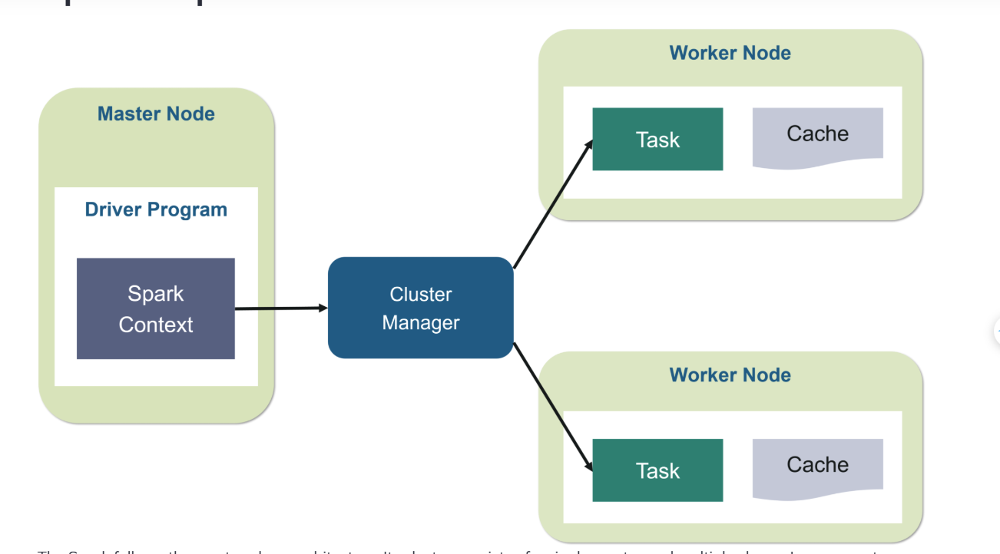

Trong đó:

\- Driver Program sẽ quản lý, điều khiển quá trình xử lý trên cluster và tạo Spark Context. Spark Context sẽ bao gồm tất cả các chức năng cơ bản.

\- Spark Driver là một thành phần quan trọng trong kiến trúc của Apache Spark. Nó là chương trình chính của ứng dụng Spark, chạy trên một node trong cluster, quản lý và điều khiển quá trình xử lý trên cluster.

\- Spark Driver và Spark Context cùng giám sát quá trình thực thi cluster. Spark Driver hoạt động với Cluster Manage để quản lý nhiều công việc khác.

\- Cluster Manage giúp quản lý và phân phối tài nguyên trên các node của cluster, sau đó sẽ phân phối và giám sát tiến trình xử lý trên các node này để đảm bảo chúng hoạt động hiệu quả.

\- Các worker nodes sẽ thực thi nhiệm vụ được giao bởi Cluster Manager và sau đó đưa nó trở lại Spark Context.

\- Executors sẽ lên tiến trình chạy trên các node khác trong cluster, được quản lý bởi driver program để thực hiện các nhiệm vụ xử lý dữ liệu. Mỗi Executor có thể chứa nhiều task (công việc) được giao để xử lý.

\- Đặc điểm của Spark là việc thực hiện lười biếng, có nghĩa là các transformation sẽ được lưu trữ lại cho đến khi có 1 thao tác action xảy ra thì các transformation mới được thực thi

2. RDD:

\- Là viết tắt của Resilient Distributed Dataset, nghĩa là Tập dữ liệu phân tán linh hoạt. RDD đại diện cho một tập hợp các phần tử dữ liệu được phân chia và phân phối trên nhiều nút trong một cụm máy tính, cho phép xử lý song song.

\- RDD có tính bất biến, chịu lỗi và có thể được sử dụng để thực hiện các phép biến đổi và hành động trên dữ liệu.

\- Trước khi được phân về các worker node thì cấu trúc dữ liệu sẽ được chuyển sang RDD

\- Đặc diểm của rdd là tính bất biến của nó vì bản chất đây là tập cấu trúc lưu trữ về logic của dữ liệu => Với mỗi việc thao tác trên dữ liệu sẽ tạo ra 1 RDD mới

3. Parquet/Orc:

\- Parquet và ORC là hai định dạng lưu trữ dữ liệu theo cột, được tối ưu hóa cho các tác vụ phân tích dữ liệu lớn. Cả hai đều cung cấp khả năng nén và mã hóa hiệu quả, giúp giảm chi phí lưu trữ và cải thiện hiệu suất truy vấn.

\- Hai dạng dữ liệu này có nghĩa là việc truy vấn sẽ ko phải theo hàng, chọn theo cột giúp giảm dư thừa thông tin, cải thiện hiệu năng truy vấn

\- Parquet:

\+ Được thiết kế để lưu trữ và xử lý dữ liệu lớn một cách hiệu quả, đặc biệt là trong các hệ thống kho dữ liệu và phân tích kinh doanh

\+ Hỗ trợ các cấu trúc dữ liệu phức tạp và quá trình tiến hóa lược đồ

\+ Ưu tiên cho các tác vụ truy vấn dữ liệu, đặc biệt khi chỉ cần truy cập một số cột nhất định.

\- ORC:

\+ Được thiết kế cho các tác vụ ghi dữ liệu chuyên sâu và hỗ trợ các giao dịch ACID (Atomicity, Consistency, Isolation, Durability) trong Apache Hive.

\+ Phù hợp với việc thay đổi lược đồ thường xuyên và các thao tác trên dữ liệu như cập nhật, xóa và hợp nhất.

\+ Mặc dù có hiệu suất tốt, ORC có thể ít được hỗ trợ hơn so với Parquet.

4. Hadoop:

\- Hadoop là một framework mã nguồn mở, được viết bằng Java, dùng để xử lý dữ liệu lớn (Big Data) phân tán trên các cụm máy tính. Nó cho phép lưu trữ và xử lý dữ liệu từ gigabyte đến petabyte, sử dụng mô hình MapReduce để xử lý song song trên nhiều máy tính.

\- Kiến trúc của Hadoop:

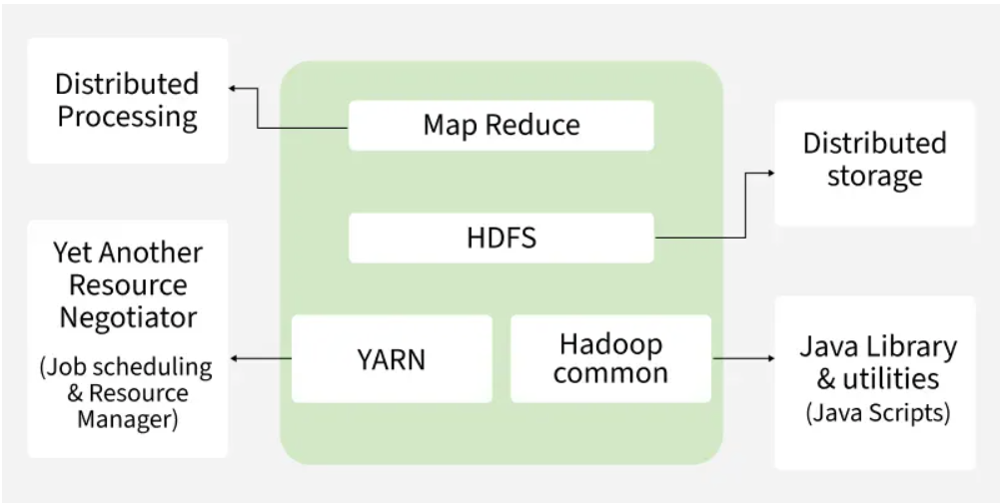

Gồm 3 lớp chính:

- **HDFS (Hadoop Distributed File System)**
- **Map-Reduce**
- **Yarn**

\- HDFS:

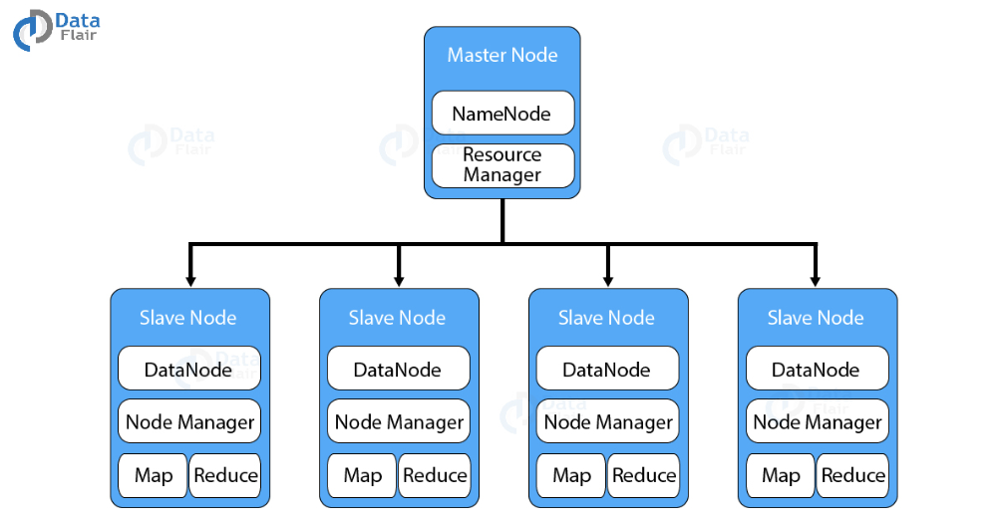

- Là hệ thống file phân tán, cung cấp khả năng lưu trữ dữ liệu khổng lồ và tính năng tối ưu hoá việc sử dụng băng thông giữa các node. HDFS có thể được sử dụng để chạy trên một cluster lớn với hàng chục ngàn node.
- Cho phép truy xuất nhiều ổ đĩa như là 1 ổ đĩa. Nói cách khác, chúng ta có thể sử dụng một ổ đĩa mà gần như không bị giới hạn về dung lượng. Muốn tăng dung lượng chỉ cần thêm node (máy tính) vào hệ thống.
- Có kiến trúc Master-Slave
- NameNode chạy trên máy chủ Master, có tác vụ quản lý Namespace và điều chỉnh truy cập tệp của client
- DataNode chạy trên các nút Slave. có tác vụ lưu trữ business data thực tế
- Một tập tin với định dạng HDFS được chia thành nhiều block và những block này được lưu trữ trong một tập các DataNodes
- Kích thước 1 block thông thường là 64MB, kích thước này có thể thay đổi được bằng việc cấu hình

\- Map-Reduce:

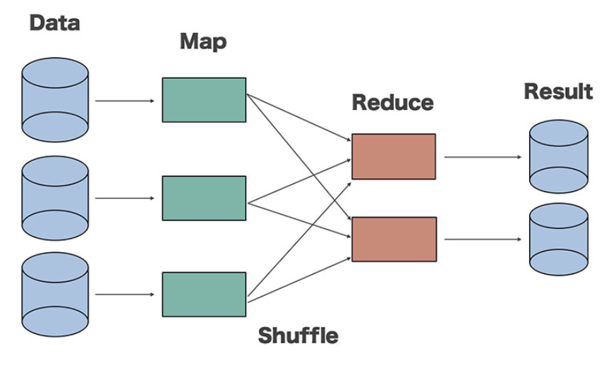

Map-Reduce là một framework dùng để viết các ứng dụng xử lý song song một lượng lớn dữ liệu có khả năng chịu lỗi cao xuyên suốt hàng ngàn cluster(cụm) máy tính

Map-Reduce thực hiện 2 chức năng chính đó là ****Map**** và ****Reduce****

- ****Map****: Sẽ thực hiện đầu tiên, có chức năng tải, phân tích dữ liệu đầu vào và được chuyển đổi thành tập dữ liệu theo cặp ****key/value****
- ****Reduce****: Sẽ nhận kết quả đầu ra từ tác vụ ****Map****, kết hợp dữ liệu lại với nhau thành tập dữ liệu nhỏ hơn

\- Yarn:

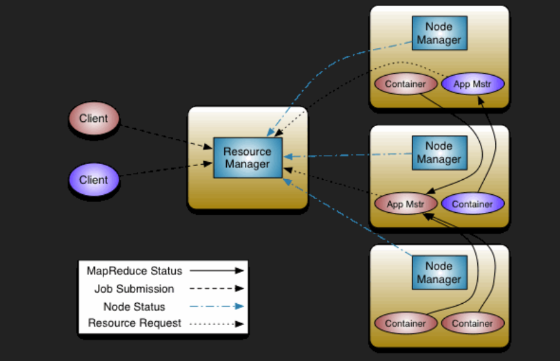

\+ YARN (Yet-Another-Resource-Negotiator) là một framework hỗ trợ phát triển ứng dụng phân tán YARN cung cấp daemons và APIs cần thiết cho việc phát triển ứng dụng phân tán, đồng thời xử lý và lập lịch sử dụng tài nguyên tính toán (CPU hay memory) cũng như giám sát quá trình thực thi các ứng dụng đó.

\+ Bên trong YARN, chúng ta có hai trình quản lý ResourceManager và NodeManage:

- ResourceManager: Quản lý toàn bộ tài nguyên tính toán của cluster.
- NodeManger: Giám sát việc sử dụng tài nguyên của container và báo cáo với ResourceManger. Các tài nguyên ở đây là CPU, memory, disk, network,...

5. Kiến trúc của Batch processing:

\- Flow Architect:

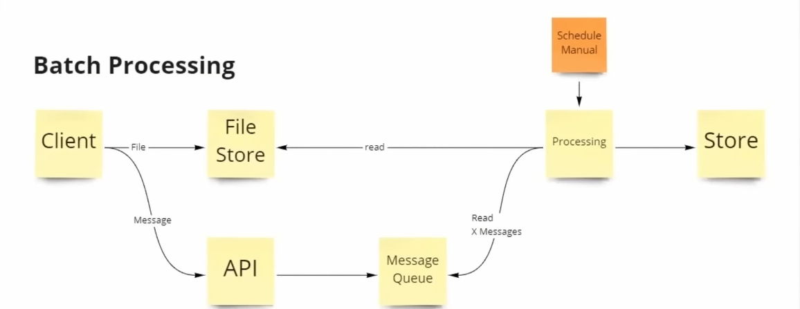

\+ Là việc xử lý dữ liệu theo lô, phù hợp cho việc phân tích dữ liệu theo tháng, quý, năm. Luồng kiến trúc mô tả cách mà batch thực hiện. Ở đây khi dữ liệu được thu thập sẽ không được lưu trữ ngay vào khi mà nó sẽ được theo cơ chế lập lịch định kỳ. Nghĩa là dữ liệu thô sẽ được lưu trữ ở file store hoặc message queue cho đến khi đến 1 thời gian định kỳ nào đó mới được xử lý và lưu lại vào kho

\+ Do là việc xử lý hàng loạt theo định kỳ nên batch processing không phù hợp với các tác vụ đòi hỏi kết quả ngay lập tức hoặc tương tác thời gian thực.

\- Ưu điểm của Batch:

**\+ Hiệu quả:**

Xử lý hàng loạt có thể tiết kiệm tài nguyên hệ thống và giảm chi phí vận hành, đặc biệt khi xử lý lượng dữ liệu lớn.

**\+ Đơn giản hóa:**

Quá trình xử lý có thể được tự động hóa và thực hiện theo lịch trình, giảm sự can thiệp của con người.

**\+ Tính nhất quán:**

Batch processing giúp đảm bảo tính nhất quán của dữ liệu khi xử lý nhiều tập dữ liệu cùng lúc.

**\+ Phù hợp với dữ liệu lớn:**

Batch processing là một giải pháp hiệu quả để xử lý dữ liệu lớn (big data) và thực hiện các tác vụ như phân tích dữ liệu, báo cáo, và trích xuất, chuyển đổi, tải dữ liệu (ETL).

## Tuần 4 – Streaming & Real-time Data

1. Kiến trúc của Kafka:

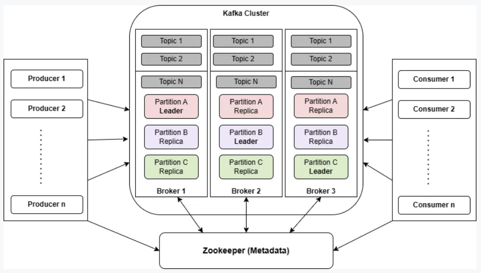

\- Dựa trên mô hình kênh sự kiện => Rất phù hợp với việc streaming và xử lý yêu cầu thời gian thực

\- Kiến trúc cơ bản của mô hình kênh sự kiện:

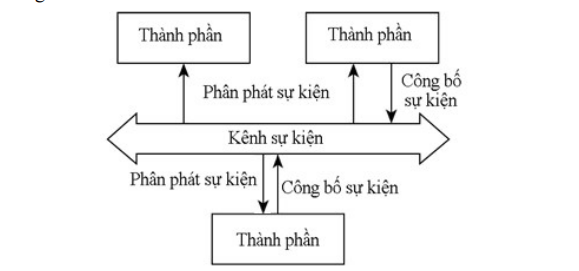

\+ Kênh sự kiện thực chất là một tiến trình làm trung gian cho các tiến trình khác trong hệ thống, nó có một tác tử luôn theo dõi vận hành của các thành viên trong hệ thống. Mỗi thành phần cung cấp dịch vụ sẽ đăng ký với kênh sự kiện, khi một tiến trình thành viên có yêu cầu dịch vụ, nó gửi đến kênh sự kiện, kênh sự kiện sẽ tiếp nhận và tìm kiếm tiến trình có thể đáp ứng yêu cầu và kết nối các thành viên đó để trao đổi với nhau

- Kafka kế thừa cực kỳ tốt mô hình này và đã phát triển thêm việc sử dụng bộ đệm buffer để xử lý yêu cầu của các thành viên giúp tăng khả năng xử lý song song

2. Chi tiết quy trình của Kafka:

- Với mỗi broker tưởng đương là 1 server xử lý yêu cầu,
- Khi producer hay consumer gửi 1 yêu cầu thì chúng sẽ được lưu và vùng buffer.
- Do áp dụng cơ chế phân tán, các broker sẽ linh hoạt hơn bằng cách nhảy vào vùng buffer này để tiếp nhận xử lý yêu cầu tránh việc phân tải nặng cho 1 broker, đồng thời giúp tăng khả năng dự phòng nóng cho hệ thống

3. Ưu điểm của Kafka:

**Giảm thiểu số lượng các thao tác đọc/ghi đĩa vật lý:**

- Thay vì ghi trực tiếp mỗi thông điệp vào đĩa, Kafka lưu trữ chúng tạm thời trong bộ đệm. Khi bộ đệm đầy hoặc có một khoảng thời gian không hoạt động, dữ liệu sẽ được ghi xuống đĩa một cách hiệu quả hơn. Điều này giúp giảm thiểu số lượng truy cập đĩa, tăng tốc độ xử lý và giảm độ trễ.

**Tăng cường độ tin cậy:**

- Bộ đệm cũng giúp Kafka bảo vệ dữ liệu trong trường hợp có sự cố xảy ra. Nếu một broker bị lỗi, dữ liệu trong bộ đệm có thể được khôi phục từ các broker khác hoặc từ các bản sao (replicas).

**Cân bằng tải và tối ưu hóa hiệu suất:**

- Khi nhiều producer gửi dữ liệu đồng thời, bộ đệm giúp Kafka phân phối các yêu cầu này một cách hiệu quả, tránh tình trạng quá tải cho một broker cụ thể.

**Đảm bảo thứ tự:**

- Trong một phân vùng, Kafka đảm bảo thứ tự của các thông điệp được giữ nguyên. Bộ đệm giúp Kafka duy trì thứ tự này trong quá trình xử lý.

4. Streaming processing:

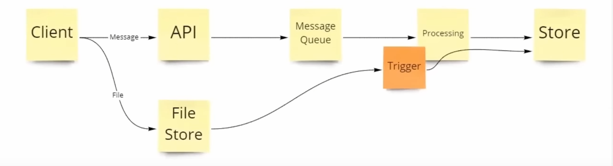

\- Là một mô hình xử lý dữ liệu theo thời gian thực hoặc gần thời gian thực (real-time hoặc near real-time), trong đó dữ liệu được xử lý ngay khi nó được tạo ra hoặc tiếp nhận

\- Ở đây mỗi khi client gửi yêu cầu, thì dữ liệu sẽ được xử lý ngay lập tức, khác với cơ chế batch phải đợi định kỳ, và sau khi xử lý thì dữ liệu sẽ được lưu vào trong kho.

\- Stream processing phù hợp với xử lý dữ liệu liên tục viws dụ như chứng khoán, crypto, phân tích hành vi người dùng trực tuyến, …

\- Ưu điểm của stream:

- Xử lý luồng cho phép phân tích dữ liệu **gần như ngay lập tức**, từ đó giúp đưa ra quyết định nhanh chóng hơn dựa trên dữ liệu thời gian thực.
- Cải thiện khả năng phản hồi: Hệ thống có thể **phản ứng kịp thời với sự kiện và thay đổi**, mang lại trải nghiệm tốt hơn cho người dùng.
- Giảm độ trễ: Xử lý dữ liệu **ngay khi nó đến**, giảm thiểu độ trễ so với mô hình xử lý theo lô (batch processing).
- Khả năng mở rộng và chịu lỗi: Các hệ thống xử lý luồng có khả năng **xử lý khối lượng dữ liệu ngày càng tăng** và có thể **khôi phục sau lỗi**, đảm bảo tính ổn định và liên tục.

## Tuần 5 – Workflow & Tích hợp

1. DAGs & operators:

\- DAG là viết tắt của Directed Acyclic Graph, một loại đồ thị có hướng và không có chu trình. Nó được sử dụng để mô hình hóa các quy trình, luồng công việc phức tạp

\- Trong DE, DAG là một chu trình xử lý dữ liệu, tại mỗi bước của DAG là việc thực hiện các toán tử trên dữ liệu hay mô tả chu trình của các RDD

2. Chi tiết:

2.1. Phân biệt các sự kiện action và transformation:

\- Action là các thao tác như display(), show() dữ liệu và khi action được kích hoạt sẽ sinh ra DAG mô tả chu trình biến đổi của dữ liệu

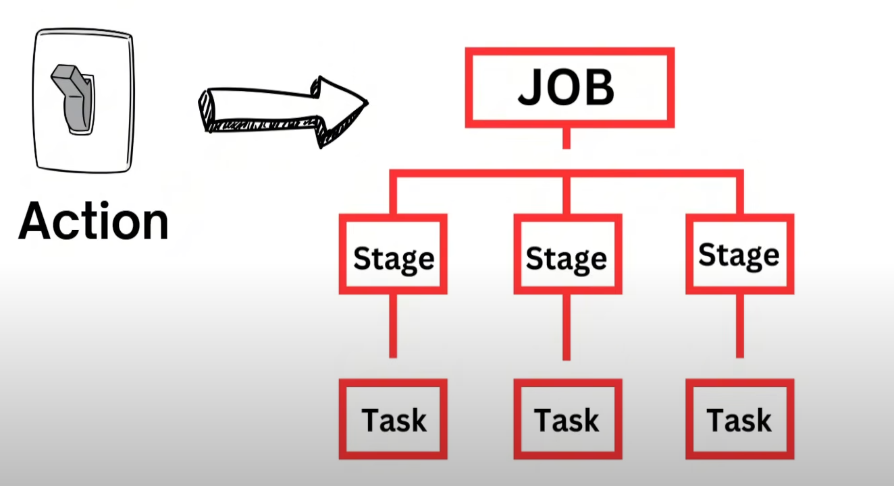

\- Ở đây DAG sẽ tưởng đương 1 job thực thi, với mỗi chu trình con sẽ được chia thành các stage dựa trên các wide transformation(group by, join, …), các stage tiếp tục chia nhỏ thành nhiều task con và các task con này được xử lý song song.

\-Transformation là các toán tử thao tác dữ liệu:

\+ Narrow transformation: Là các thao tác dữ liệu chỉ lấy từ 1 partition cha và không có xáo trộn dữ liệu

\+ Wide transformation: Là các thao tác dữ liệu lấy từ nhiều partition cha gây xáo trộn dữ liệu

\+ Và đa phần các wide transformation sẽ tạo ra 1 stage mới vì phải phân vùng dữ liệu

2.2. Các tranfomation phổ biến:

| **Ý nghĩa** | **Thao tác** | **Loại** |
| --- | --- | --- |
| Biến đổi dữ liệu dòng một | map(), flatMap() | Narrow |
| Lọc dòng theo điều kiện | filter() | Narrow |
| Tính tổng hoặc đếm theo nhóm (key) | reduceByKey() | Wide |
| Gom nhóm dữ liệu theo key | groupByKey() | Wide |
| Ghép dữ liệu từ 2 RDD theo key | join() | Wide |
| Xóa phần tử trùng | distinct() | Wide |
| Sắp xếp dữ liệu | sortByKey() | Wide |

3. Apache Airflow:\
3.1 Định nghĩa:

\- Apache Airflow là một nền tảng **orchestration workflow** mã nguồn mở dùng để **lập lịch, theo dõi và quản lý các pipeline xử lý dữ liệu (ETL/ELT).**

\- Phù hợp với cơ chế xử lý theo lô batch processing

3.2 Kiến trúc:

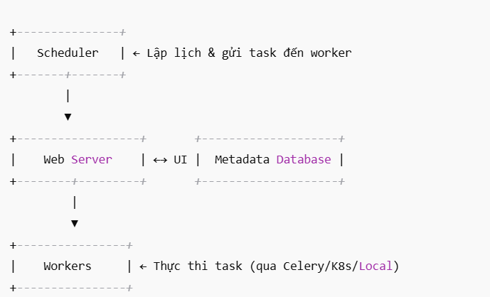

\- Các thành phần chính:

| **Thành phần** | **Mô tả ngắn** |
| --- | --- |
| **DAG (workflow)** | Định nghĩa luồng công việc không có chu trình |
| **Task** | Tác vụ cụ thể trong DAG |
| **Operator** | Định nghĩa cách task được thực thi (Python, Bash, SQL...) |
| **Scheduler** | Lập lịch task chạy theo cron, thời gian, hoặc trigger |
| **Executor** | Cơ chế chạy task (Local, Celery, Kubernetes, ... ) |
| **Web UI** | Theo dõi trạng thái, retry, log |
| **Metadata DB** | Lưu trạng thái DAG, task, log, lịch sử |

\- Các operator phổ biến:

| **Operator** | **Dùng để...** |
| --- | --- |
| PythonOperator | Chạy function Python |
| BashOperator | Chạy lệnh Bash |
| EmailOperator | Gửi email |
| HttpSensor | Chờ HTTP endpoint sẵn sàng |
| PostgresOperator | Thực thi SQL trên PostgreSQL |
| TriggerDagRunOperator | Kích hoạt DAG khác |

4. Apache NiFi & API integration:\
    4.1 Định nghĩa:
- Apache NiFi là một công cụ **xử lý dữ liệu theo luồng (dataflow)** rất mạnh, đặc biệt hữu ích trong các tình huống **tích hợp API, di chuyển dữ liệu,** và **tự động hóa luồng dữ liệu giữa các hệ thống.**
- NiFi tốt trong việc xử lý steam và thời gian thực hay stream processing và đặc biệt hỗ trợ việc kéo thả mà không cần code\
    4.2 Kiến trúc:

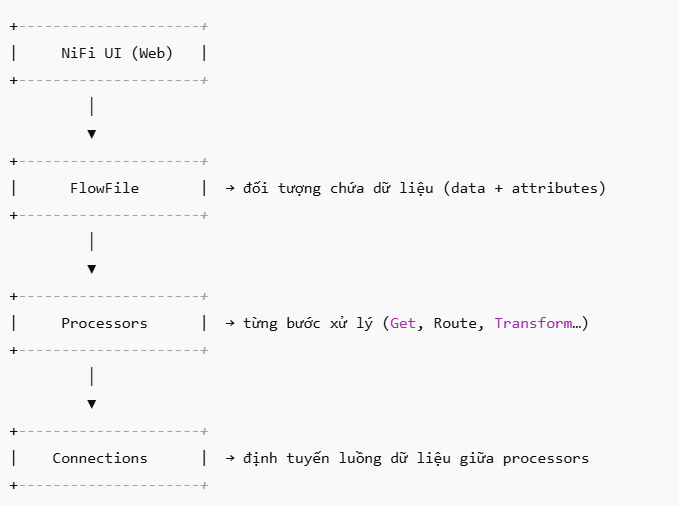

\- Các processor phổ biến

| **Loại Processor** | **Tên phổ biến** | **Mô tả ngắn** |
| --- | --- | --- |
| **Input** | GetFile, ListenHTTP, ConsumeKafka | Lấy dữ liệu từ nguồn |
| **Transform** | UpdateAttribute, EvaluateJsonPath | Thay đổi nội dung/metadata |
| **Route** | RouteOnAttribute, RouteOnContent | Điều hướng dữ liệu theo điều kiện |
| **Output** | PutFile, PutDatabaseRecord, PublishKafka | Gửi dữ liệu đến nơi đích |
| **API** | InvokeHTTP, HandleHttpRequest | Gọi hoặc nhận dữ liệu từ API |

\- Các processor API phổ biến:

| **Processor** | **Mô tả ngắn** |
| --- | --- |
| InvokeHTTP | Gọi API HTTP (GET, POST, PUT...) |
| HandleHttpRequest | Lắng nghe API từ bên ngoài (HTTP server) |
| PutHTTP | Gửi dữ liệu đi như một HTTP Client |
| EvaluateJsonPath | Trích dữ liệu từ JSON (trả về từ API) |
| JoltTransformJSON | Biến đổi cấu trúc JSON |

## Tuần 6 – Production Pipeline
